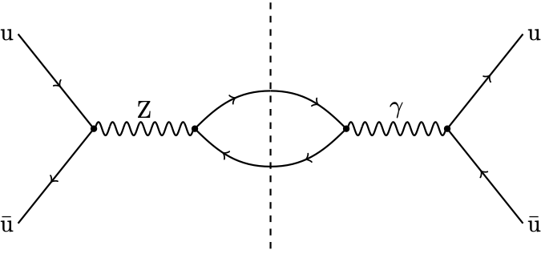

# Drell-Yan process

We start by considering the following process

$$
\mathrm{q} \bar{\mathrm{q}} \to \mathrm{Z}/\gamma \to \mathrm{e}^{-} \mathrm{e}^{+},
$$

and we only consider the interference term as shown below.

<div align="center">

</div>

## Download dataset

In order to download the datasets just run

```python
python get_data.py
```
