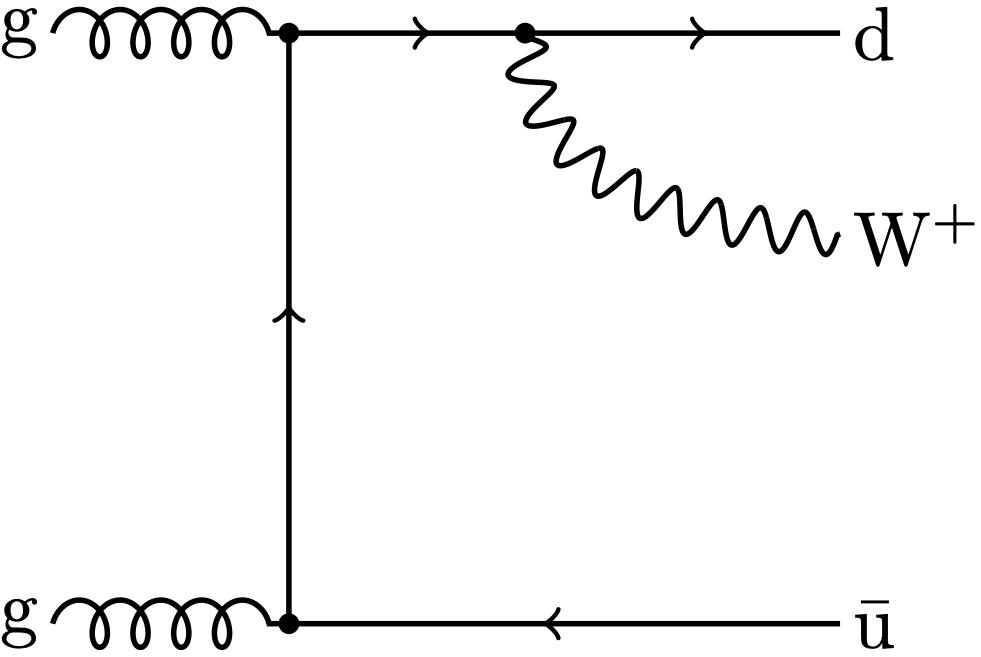

# W + 2 Jets production

We start by considering the following process

```math
\mathrm{g} \mathrm{g} \to \mathrm{W}^+ \mathrm{d} \bar{\mathrm{u}}
```

<div align="center">

</div>

## MadGraph API

### Installation and test

Download and untar the `madevent.tar.gz` file. And do the follwing steps:

Compile the code (carefull you need to have f2py executable).
First, make_opts to fit your computer --here configure for macos--
then

```bash
cd Source
make
cd ../SubProcesses/P1_gg_wpqq
make madevent.so
```

Then run the python test code which is also in the `/SubProcesses/P1_gg_wpqq` folder with

```bash
python test.py
```

### Functions of the API

The relevant python api funtions are
```python
configure_code(multi_channel_in,helicity_sum,dconfig)
wgt = madevent_api(r,apply_cut,ndim=len(r))
answer = get_number_of_random_used()
pout = get_momenta()
```

which do the following:
- `configure_code` can only be called once so far and dconfig corresponds to the channel of integration
- `madevent_api` returns the weight for the given set of random numbers in a single-channel specified in `configure_code`.
For now, only a single channel can be evaluated at a time.
    - Note: the number of random number should be at least 12 (but only the first 7 are used for the generation of the momenta and therefore are relevant, the rest ist linked to color etc.)
- `get_number_of_random_used` get the actual number of random number used for the last call to madevent_api
- `get_momenta` returns the momenta for the last call to madevent_api
