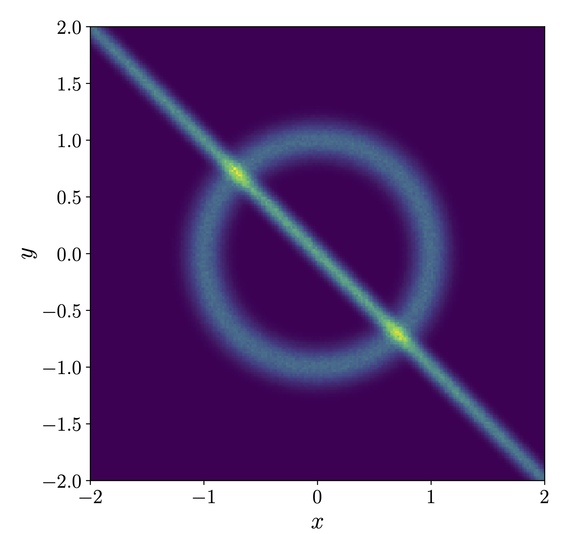

# 2-Dimensional Ring

In this two-dimensional example we use a typical example
for multi-channeling where standard `VEGAS` fails. In this example we train both, the multi-channel weights $\alpha_i(x,\theta)$ 
as well as the conditional normalizing flow $H(x,\varphi\vert i)$ which yields the importance weight $h(x,\varphi\vert i)$. 
In principle, we can combine this numeric importance weight with an additional weight $g_i(x)$ coming from an analytic phase-space mapping
$G_i(x)$ to a total importance weight

$$ q(x,\varphi\vert i) = h(x,\varphi\vert i)\cdot g_i(x).$$

<div align="center">

</div>

## Function and mapping

We consider the overlap of a gaussian ring and a gaussian 'line' distribution, which is defined by:

```math
P_\text{multi}=\frac{1}{2}P_\text{ring}+\frac{1}{2}P_\text{line}\,
```

with

```math
P_\text{ring}(x_1,x_2) = N_0\,\mathrm{exp}\left(-\frac{1}{2\sigma_0^2}(\sqrt{x_1^2+x_2^2}-r_0)^2\right),\qquad\qquad\qquad\quad
```
```math
P_\text{line}(x_1,x_2) = N_1\,\mathrm{exp}\left(-\frac{1}{2\sigma_1^2}(\tilde{x}_1-\mu_1)^2\right)\mathrm{exp}\left(-\frac{1}{2\sigma_2^2}(\tilde{x}_2-\mu_2)^2\right),
```

where $N_0$ and $N_1$ are chosen such that each distribution is normalized individually and

```math
\tilde{x}_1=\frac{1}{\sqrt{2}}\left(x_1-x_2\right)\,,\qquad \tilde{x}_2=\frac{1}{\sqrt{2}}\left(x_1+x_2\right)\,.
```

More details in the draft.

## Training

Commands for `mcw`:

```python
# train the multi-channel weights only with fixed analytic mappings (optinally adding arguments, see --help)
python train_mcw.py (--arg ARG)
```

Commands for `flow`:

```python
# train the flow only with fixed weights (optinally adding arguments, see --help)
python train_flow.py (--arg ARG)
```

Commands for `mc-flow`:

```python
# train the flow simultanously with the multi-channel weights (optinally adding arguments, see --help)
python train_mcflow.py (--arg ARG)
```

Commands for `mc-map-flow`:

```python
# train the flow simultanously with the multi-channel weights and additional analytic remappings (optinally adding arguments, see --help)
python train_mcmapflow.py (--arg ARG)
```
   
   
